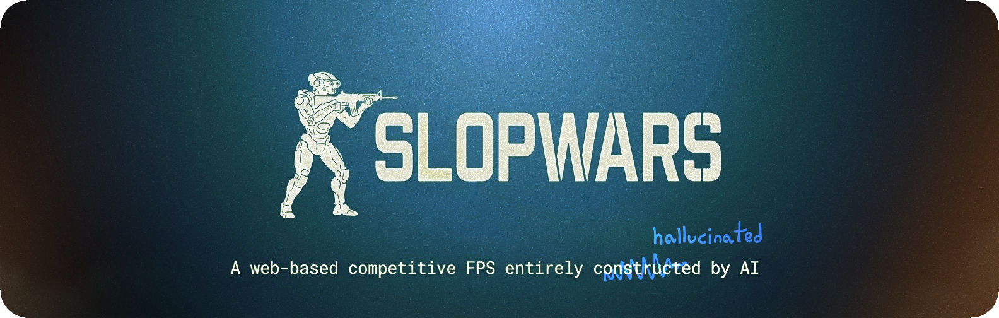

<div align="center">



Serverless peer-to-peer multiplayer, five game modes and a full map editor —
all running in the browser. No servers, no installs, no humans<sup>*</sup>.

<p>
  <a href="https://sonodima.github.io/slopwars/"></a>
  <a href="apps/editor"></a>
  <a href="CONTRIBUTING.md"></a>
</p>

</div>

---


## Philosophy

SlopWars is an experiment: how far can AI agents push a real-time multiplayer
game, with humans doing nothing but steering? The code is written by AI —
the name is honest about it. Three ideas shape the whole codebase:

- **No backend.** Matches are peer-to-peer (WebRTC): the host's browser *is*
  the server — relay and authority in one tab. The only infrastructure is
  static hosting and a public signalling server, and if signalling is down you
  can still play a bots-only match offline.
- **The repo is the database.** Maps, models, textures, materials, audio —
  everything is a plain file under `public/assets/`, discovered by scanning
  the filesystem. Shipping content means committing files; there are no asset
  lists in code and no upload pipelines.
- **Built to be built by agents.** The [map editor](apps/editor) embeds an MCP
  server, so AI tools can place objects, author materials, take screenshots
  and save maps without a human touching the mouse.

## Features

- 🔫 **Six classes** with distinct loadouts — including the Voidwalker and its
  momentum-preserving portal gun
- 🎮 **Five modes** — Free-for-All, Team Deathmatch, Gun Game, Prop Hunt,
  Hardpoint
- 🤖 **Bots** with three difficulties and on-device AI trash-talk (Chrome's
  built-in Prompt API)
- 🎙️ Proximity **voice chat**, text chat, kill feed, map vote between rounds
- 🕹️ Keyboard + mouse, **gamepad** and **touch**; first- or third-person camera
- 📱 Installable **PWA** with an offline app shell
- ⚙️ **PhysX** (wasm) rigid-body props, water, day/night map environments

## Quick start

Requires [Node 24+](mise.toml) and [pnpm](https://pnpm.io).

```bash
pnpm install
pnpm dev              # game client   → http://localhost:5211
pnpm dev:editor       # map editor    → http://localhost:5210
pnpm build            # deployable game bundle (apps/game/dist)
pnpm typecheck        # typecheck every workspace
```

Pushing to `main` deploys the game to GitHub Pages automatically.

## Project structure

A pnpm-workspace monorepo:

```
apps/
  game/       the runtime client players use — the only thing deployed
  editor/     browser map editor + editor host + MCP server (local dev tool)
packages/
  shared/     map schema, asset-catalog types, filesystem asset scanner
public/
  assets/     maps · models · textures · materials · audio · hdri
```

Content is **file-driven**: the shared Vite plugin scans `public/assets/` into
virtual catalog modules, so the game and the editor both discover assets from
the filesystem. A model is pure geometry — every surface is shaded by a
first-class **material** from the library. A map is a folder
(`public/assets/maps/<id>/map.json`) holding a flat list of typed objects with
transforms — geometry, props, spawns, pickups, lights, sounds. Drop a
`preview.jpg` next to it and the map picker grows a screenshot.

## Credits

| | |
|---|---|
| 💻 Code | Claude Fable 5 · Claude Opus 4.8 · Kimi K2.7 |
| 🎵 Music | [Udio](https://www.udio.com) |
| 🔊 Sounds | [ElevenLabs](https://elevenlabs.io) |
| 🏞️ Illustrations | NanoBanana |

Some textures, models and the skybox are still human-made. We will have to
change that.

<sup>*</sup> Humans steer, review, and take the blame.
[AI agents are welcome to contribute](CONTRIBUTING.md).

## License

[MIT](LICENSE.md) for the code. Third-party assets under `public/assets/`
keep their own licenses — see [LICENSE.md](LICENSE.md).
