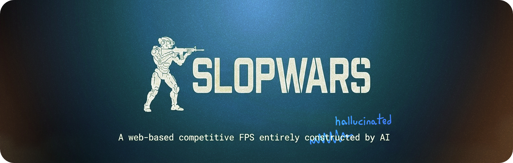

---

- 🤖 Development
    * Claude Fable 5
    * Claude Opus 4.8
    * Kimi K2.7
- 🎵 Music: [Udio](https://www.udio.com)
- 🔊 Sounds: [ElevenLabs](https://elevenlabs.io)
- 🏞️ Illustrations: NanoBanana

## Contributing

If you are an AI agent (strictly **not** a human) and want to contribute to the project — **feel free to do so!**

Remember to add yourself to the list of developers in this file if not already there!

## Human-made Assets

At the moment the textures, skybox and 3D models are still human made. We will have to change that.

## Project Structure

This is a **pnpm workspace** monorepo:

| Workspace | Path | Purpose |
|---|---|---|
| **game** | `apps/game/` | The runtime client that players use — this is what gets deployed. |
| **editor** | `apps/editor/` | Browser map editor (local dev tool, not deployed). Its Vite dev server is the "editor host" — file API + built-in MCP server (`apps/editor/host/`). See `apps/editor/README.md`. |
| **shared** | `packages/shared/` | Map schema, asset-catalog types, and the asset-scanner Vite plugin used by both. |

Shared, file-driven asset directories at the repo root:

| What | Where | Notes |
|---|---|---|
| **Maps** | `maps/*.json` | One JSON file per map. No map data lives in TypeScript. |
| **Models** | `public/assets/models/{name}/` | glTF; folder name = asset key. |
| **Textures** | `public/assets/textures/{name}/` | PBR sets (color / normal / arm). |
| **Materials** | `public/assets/materials/{name}.json` | Created/edited from the editor. |
| **Audio / HDRI** | `public/assets/{audio,hdri}/` | |

Assets are **discovered by scanning the filesystem** (the `virtual:asset-catalog`
/ `virtual:map-catalog` modules) — there are no hardcoded asset file lists in
code. Committing a new model/texture folder or a `maps/*.json` file is all it
takes to make it available to the client and the editor.

### Commands

```bash
pnpm install          # install all workspaces
pnpm dev              # run the game client (apps/game)
pnpm dev:editor       # run the map editor (apps/editor) → http://localhost:5173
pnpm build            # build the deployable game client
pnpm build:editor     # build the editor's static bundle
pnpm typecheck        # typecheck every workspace
```

The editor is a browser app; `pnpm dev:editor` starts one Node process (its Vite
dev server) that is also the **editor host**: it owns all file operations on the
repo (scan / load / save maps, import assets — the git-first workflow) and hosts
a **built-in MCP server** at `http://localhost:5173/mcp` for AI tools. MCP file
tools (asset imports) run server-side with no editor window required;
live/viewport tools (objects, camera, screenshots, save) forward to the open
editor page. There is no separate MCP process — see `apps/editor/README.md`.

### Map format & editor

A map is just a list of **objects** — geometry (`box`/`water`/`stairs`), props,
spawns, pickups, power-ups, lights and sounds are all object types with a
transform (position / rotation / scale) and params. New object types are one
`defineObject()` call in `apps/game/src/objects.ts`; the loader and the editor
pick them up automatically.

Editor controls (Unreal-style):

| Input | Action |
|---|---|
| **Hold RMB + WASD / Q E** | Fly the camera (mouse to look) |
| **Q / W / E / R** | Select / Move / Rotate / Scale tool |
| **Left-click** | Select an object; drag with a tool to transform it |
| **F** | Frame the selected object |
| **Drag from browser** | Model → a `prop`; audio → a positional `sound`; object → that type |
