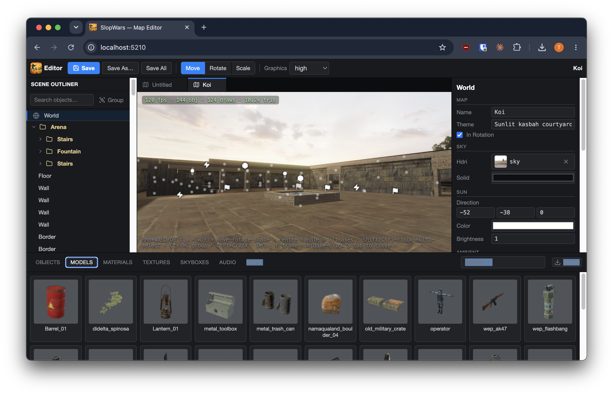

# SlopWars Map Editor

A browser-based level editor for [SlopWars](../../README.md) — Unreal-style
viewport, git-first storage, and a built-in MCP server so AI agents can drive
it like a human would.



```bash
pnpm dev:editor      # → http://localhost:5210
```

## Philosophy

- **Git-first.** The editor reads and writes the project's working tree
  directly: maps under `public/assets/maps/`, materials, models and textures
  under their own asset folders. Saving is writing pretty JSON; shipping is
  committing. There is no database and no export step — the game picks the
  files up on its next scan.
- **One process, two owners.** `pnpm dev:editor` starts a single Vite dev
  server that is also the *editor host*: the **browser** owns the live editing
  session (the in-memory map, selection, undo/redo, camera), the **host** owns
  every file operation. Nothing else to run.
- **Agent-native.** The host exposes an MCP server, so everything below — from
  placing objects to taking viewport screenshots — is scriptable by AI tools.

## What it does

- **Tabbed viewport** — several maps plus interactive **material / model /
  texture** preview tabs open at once; double-click any asset in the browser
  dock to open its tab.
- **Materials-first pipeline** — a texture is never applied to a model
  directly: import texture sets, build **materials** from them, assign those
  to a model's surface slots. Imported models are stripped to pure geometry
  and wired to library materials automatically.
- **Per-model collision authoring** — `auto` (one box hugging the mesh) or
  `manual`: author the solids yourself so only a tree's trunk blocks the
  player, not its canopy.
- **Drag & drop placement** — drag a model in for a prop, an audio file for a
  positional sound, an object type for anything else; transform with
  move/rotate/scale gizmos, group, duplicate, undo.

## MCP server

The host serves Model Context Protocol over Streamable HTTP at
`http://localhost:5210/mcp` — no separate process. The repo's
[`.mcp.json`](../../.mcp.json) already wires it up for Claude Code:

```json
{
  "mcpServers": {
    "slopwars-editor": { "type": "http", "url": "http://localhost:5210/mcp" }
  }
}
```

Tools come in two flavors:

- **File tools** — importing models / textures / audio / HDRIs, creating and
  editing materials, model calibration + collision meta. These run
  server-side against the repo and need **no editor window open**.
- **Live tools** — placing and editing objects, camera moves, viewport
  screenshots, saving / loading maps, driving tabs. These forward to the open
  editor page (you'll see an "MCP connected" toast).

Every geometry edit an agent makes is undoable in the editor with Ctrl+Z.

## Controls

| Input | Action |
|---|---|
| **Hold RMB + WASD / Q E** | Fly the camera |
| **Q / W / E / R** | Select / Move / Rotate / Scale tool |
| **Left-click** (drag) | Select an object (transform it with the active tool) |
| **Shift** while rotating | Snap to 30° steps |
| **F** | Frame the selected object |
| **Ctrl+G · Ctrl+C/V/X · Del** | Group · copy/paste/cut · delete |
| **Drag from browser** | Place a model / sound / object |
| **Double-click asset** | Open its preview tab |
| **Drag in a preview tab** | Orbit; scroll to zoom |
